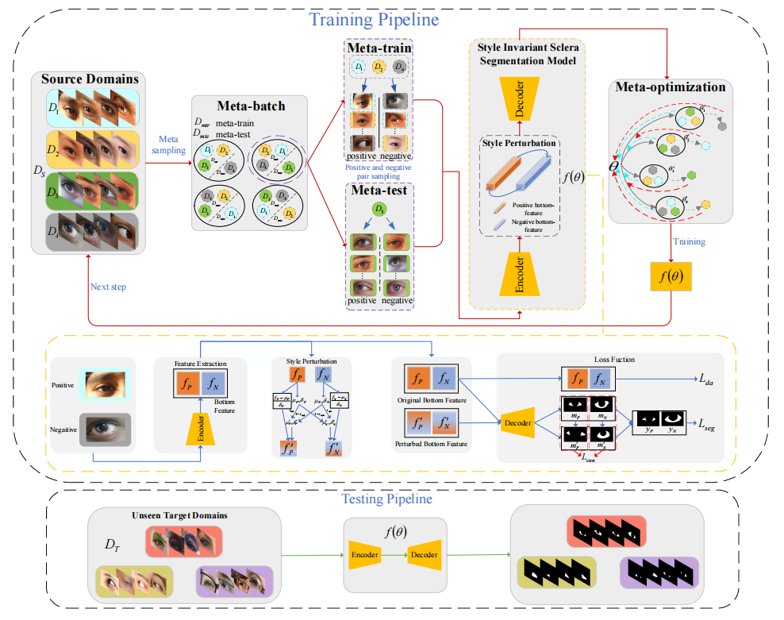

# MetaScleraSeg: An Effective Meta-Learning Framework for Generalized Sclera Segmentation
This repository contains the official PyTorch implementation of:

**MetaScleraSeg: An Effective Meta-Learning Framework for Generalized Sclera Segmentation**   



## Prerequisites

- Python 3.8
-  NVIDIA GPU + CUDA CuDNN
-  \>= PyTorch 1.8.0

## Paper data and models
- We build a Cross-Domain Sclera Segmentation (CDSS) dataset with diverse ethnicity and quality as domain labels to supplement the
existing dataset. You can download the dataset as follows: [[Baidu Drive]](https://pan.baidu.com/s/1JvPfyNUxPFIBbYHvfkZW7A?pwd=k1hu 
)

- The trained models can be downloaded via: [[Baidu Drive]]

## How to run the code?

```
python test.py 
```

## Questions
Please contact haiqing_li@stu.bucea.edu.cn
